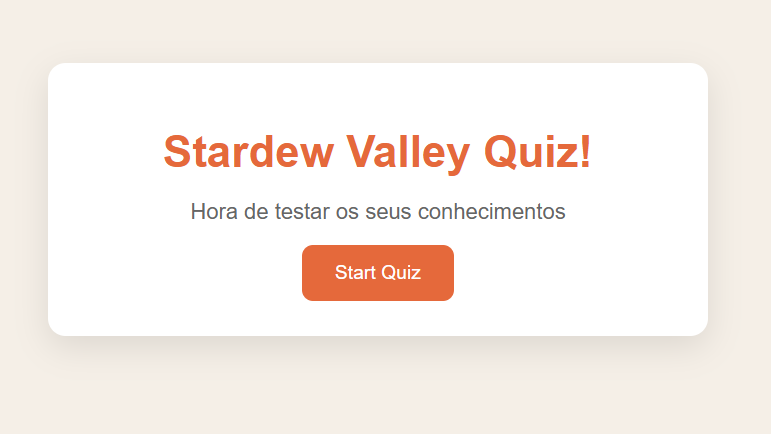
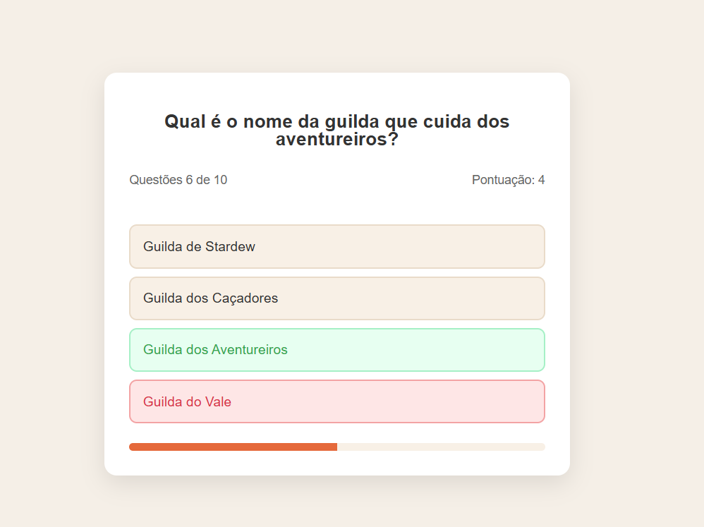

# Stardew Valley Quiz :seedling:

Um quiz simples feito em HTML semântico e CSS como forma de prática e diversão.
O objetivo é testar conhecimentos sobre o jogo Stardew Valley e, ao mesmo tempo, relembrar conceitos básicos de front-end.

## SOBRE:

- Desenvolvido como treino pessoal em HTML e CSS
- Foco em usar tags semânticas corretamente
- Layout simples, com possibilidade de personalização futura
- Estilo leve, inspirado no universo do jogo

## Pré-visualização

Tela inicial do quiz:

Exemplo de perguntas e alternativas:

Alternativa correta destacada ✅
Alternativa incorreta ❌

## 🎮 Funcionalidades

- Perguntas com múltiplas alternativas
- Indicação de resposta correta/incorreta
- Experiência divertida para quem gosta de Stardew Valley

## Tecnologias utilizadas

- HTML5
- CSS3
- JAVASCRIPT

## 📜 Licença

Este projeto foi desenvolvido apenas para estudo e diversão.  
Algumas ideias foram baseadas no conteúdo do canal **[Codesistency](https://www.youtube.com/@codesistency)**.  
Todos os créditos ao criador original pelas inspirações.  
